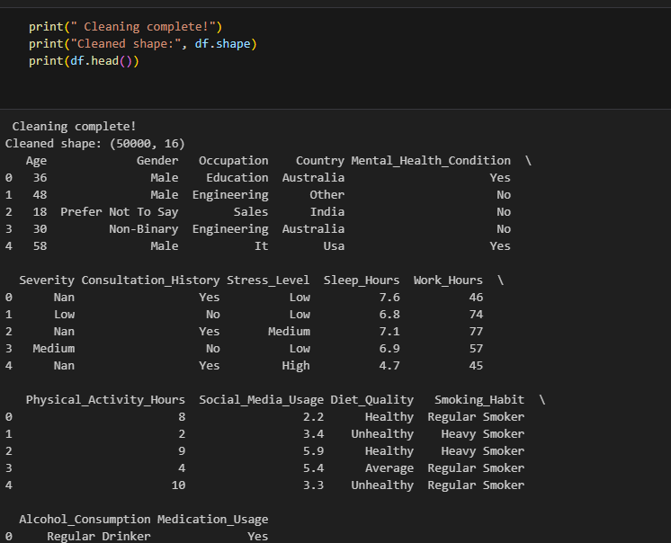
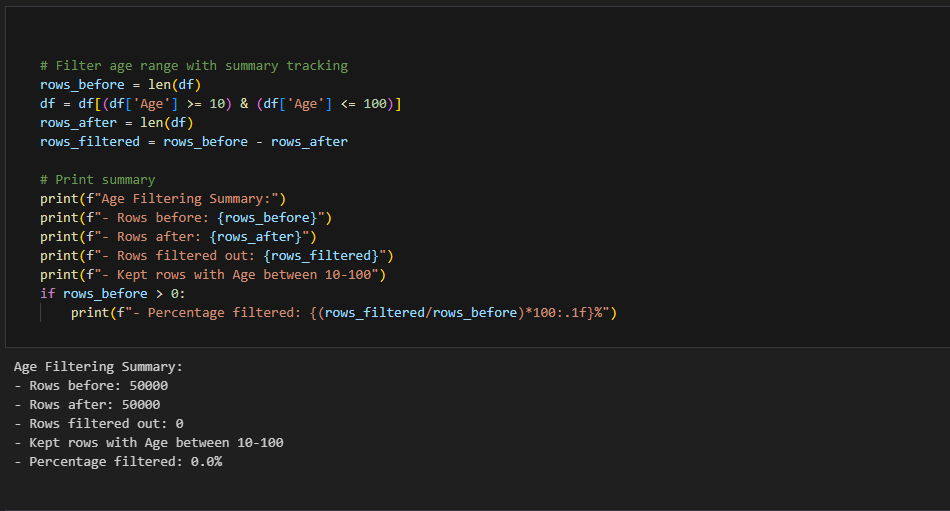
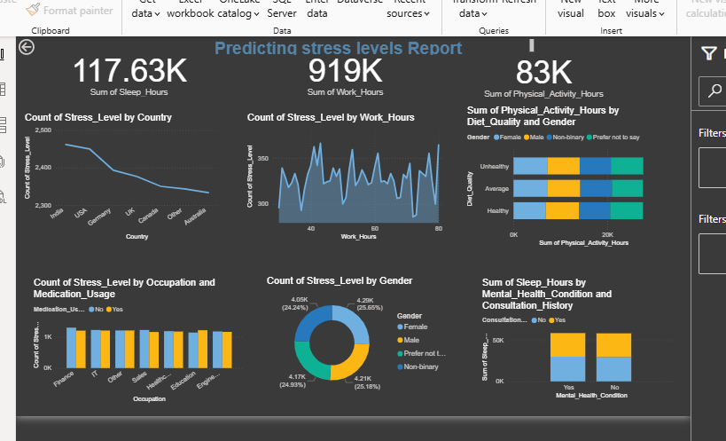
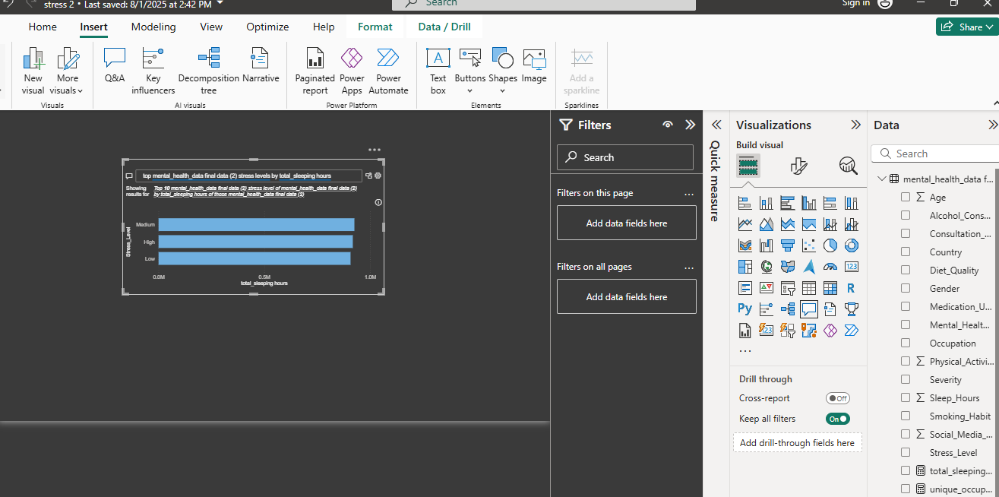
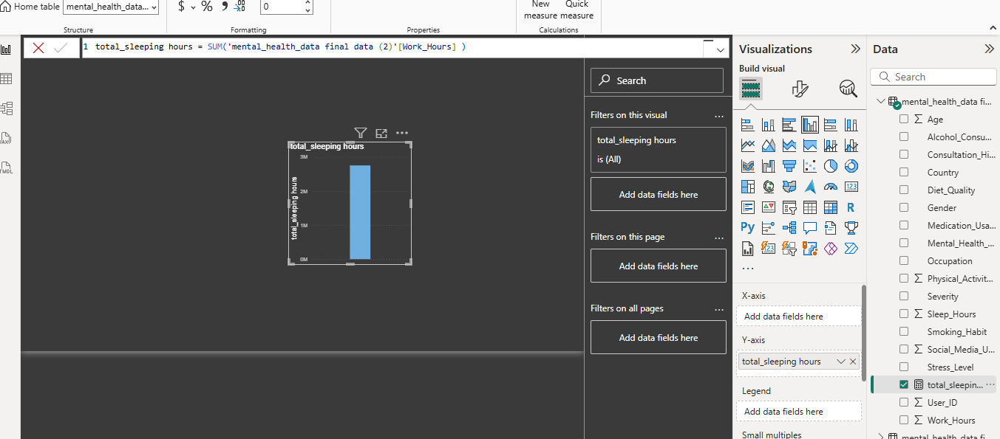
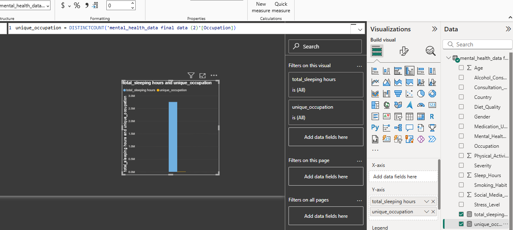

# 27628_predicting_stress_levels_analysis.
This project predicts stress levels using workplace and lifestyle factors to identify high-risk niche for mental health support. It combines machine learning (Python) with an interactive Power BI dashboard for insights and early intervention.
# stress level Data Analysis Project 

##  Dataset Description

The dataset contains **50,000 records** with **15 features** related to mental health and lifestyle factors:

| Feature | Description | Type |
|---------|-------------|------|
| Age | Individual's age | Integer |
| Gender | Gender identity | Categorical |
| Occupation | Professional field | Categorical |
| Country | Country of residence | Categorical |
| Mental_Health_Condition | Target variable (presence of mental health condition) | Binary |
| Consultation_History | Previous mental health consultations | Binary |
| Stress_Level | Self-reported stress levels | Categorical |
| Sleep_Hours | Average hours of sleep per night | Float |
| Work_Hours | Weekly working hours | Integer |
| Physical_Activity_Hours | Weekly physical activity | Integer |
| Social_Media_Usage | Daily social media usage hours | Float |
| Diet_Quality | Quality of diet | Categorical |
| Smoking_Habit | Smoking behavior | Categorical |
| Alcohol_Consumption | Alcohol consumption patterns | Categorical |
| Medication_Usage | Mental health medication usage | Binary |

##  Key Findings

###  Data Distribution
- **117.63K** total sleep hours recorded
- **919K** total work hours across all participants  
- **83K** total physical activity hours
- Balanced distribution across stress levels and demographics

## Analysis Components

### 1.  Data Preprocessing
-  Cleaned dataset with 50,001 records
-  Handled missing values using median/mode imputation
-  Removed duplicates and outliers
-  Standardized categorical variables using Label Encoding

  

### 2.  Exploratory Data Analysis
- **Stress Level Distribution**: Relatively balanced across categories
- **Age Distribution**: Normal distribution (mean ~41 years)
- **Correlation Analysis**: Lifestyle factors relationships visualization

### 3.  Machine Learning Models
- **Random Forest Classifier**: Ensemble method for robust predictions
- **Logistic Regression**: Linear baseline model
- **Weighted Ensemble**: Combined models for improved accuracy

##  Visualizations

### Power BI Dashboard Screenshots
 
## AI visuals
 
## dax formlula

.

###  Key Charts Include:
- Stress Level by Country (Geographic distribution)
- Work Hours vs Stress (Correlation analysis)
- Physical Activity by Demographics
- Sleep Patterns Analysis

